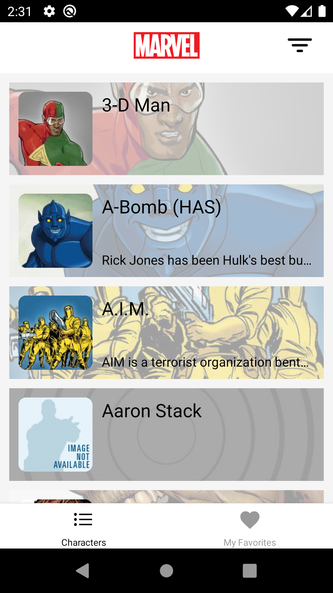
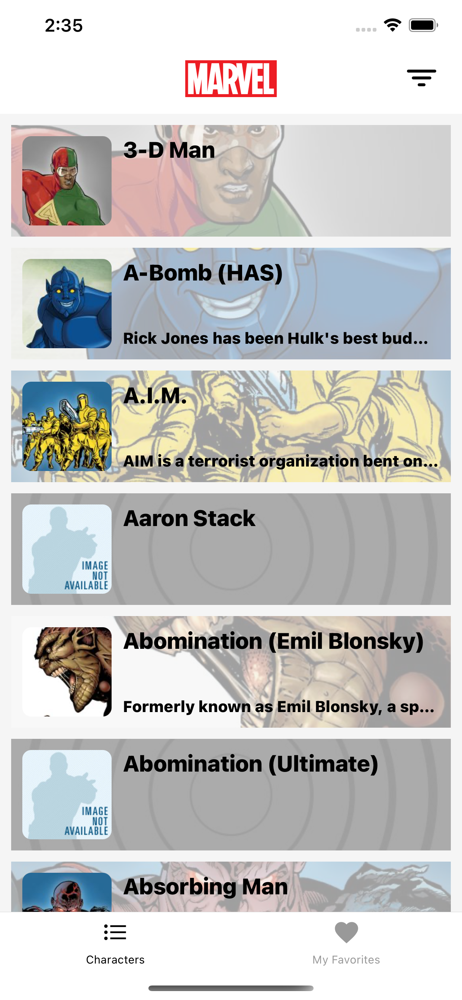

# ChallengeMobileReactNative

- [ChallengeMobileReactNative](#challengemobilereactnative)
  - [Solução](#solução)
  - [Funcionamento](#funcionamento)
  - [Instalação](#instalação)
  - [Como rodar](#como-rodar)
  - [Screenshots/vídeo](#screenshotsvídeo)

## Solução

Projeto criado com o comando `npx react-native init ChallengeMobileReactNative` utilizando a versão `0.63.4`.

Roda em dispositivos Apple (iOS) e em Android.

**O apk pode ser baixado [aqui](https://github.com/filipepiresg/challenge-mobile-react-native/releases)**

## Funcionamento

Ao abrir o app, na aba principal, será feito uma requisição para a api da marvel e será carregado todos os 20 primeiros personagens. Após isso, é possível descer a lista e será carregado automaticamente novos personagens e adicionados ao final da lista.
Ao pressionar o card de um personagem, será exibido um modal com os dados do personage, e no canto superior direito terá um botão para adicionar/remover um favorito.
Também será possível pressionar o ícone de filtragem no header e será exibido um input para adicionar o nome de algum personagem para busca, é possível fazer o carregamento pressionando o botão `Enviar` no teclado, ou o botão vermelho ao lado do input.

Na aba de `Meus Favoritos`, é possível visualizar todos os personagens ao qual eu já adicionei, anteriormente.

## Instalação

Requisitos:

- [NodeJS](https://nodejs.org/en/download/)
- [React-native](https://facebook.github.io/react-native/docs/getting-started)
- **XCode**[1], ou o **Android Studio**[2]

Primeiro, baixar e instalar o NodeJS na versão LTS.

Instalação para dispositivos iOS

Após a conclusão do comando anterior, deve-se baixar e instalar o xcode\* com o `command-line tools` instalado.

\* Para mais informações, abrir a documentação do react-native abaixo.

Instalação para dispositivos Android

Após a conclusão do comando anterior, é necessário baixar e instalar o Android Studio e também criar um emulador\*.

\* Para mais informações, abrir a documentação do react-native abaixo.

[Documentação do React-Native](https://facebook.github.io/react-native/)

> [1] Somente para máquinas Mac

> [2] Para máquinas Mac/Windows/Linux

## Como rodar

- **Modo Produção:**
  1. Para ios, não é possível, sem adicionar uma conta de desenvolvimento apple válida.
  2. Para android, é possível fazer o download na `release` do repósitorio ou em [apk](./downloads/app.apk) e instalar no dispositivo.

- **Modo Desenvolvimento:**
  Após obter o repositório do projeto, por clone (com o comando `git clone https://github.com/filipepiresg/challenge-mobile-react-native`) ou download, deverá ser feito o download das dependências do projeto através do comando `yarn install` no terminal.

  Deverá ser criado um arquivo `.env`, adicionado as keys da `marvel api`, seguindo a estrutura do arquivo [env-sample](./.env.sample).
  Se tudo estiver dado certo, o projeto já deve estar funcionando perfeitamente e para rodar tem que utilizar o comando `yarn run ios` ou `yarn run android` para dispositivos iOS e android, respectivamente.

   
Caso seja utilizado o android, é necessário abrir o emulador antes de rodar o projeto

  Após ter instalado no dispositivo, pela primeira vez, não é necessário rodar esse comando (pois demora demais) podemos simplesmente rodar o comando `npx react-native start` para que o bundler inicie rapidamente.

## Screenshots/vídeo

- Android
  - 
    - Go to [android screenshots](./screenshots/android) e veja o vídeo, caso necessário
- iOS
  - 
    - Go to [ios screenshots](./screenshots/ios) e veja o vídeo, caso necessário
